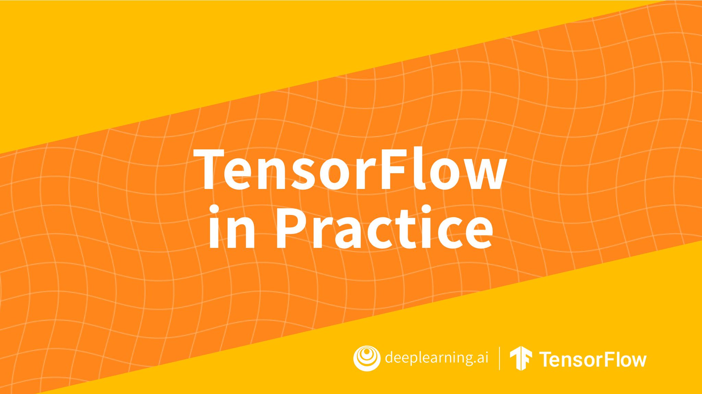
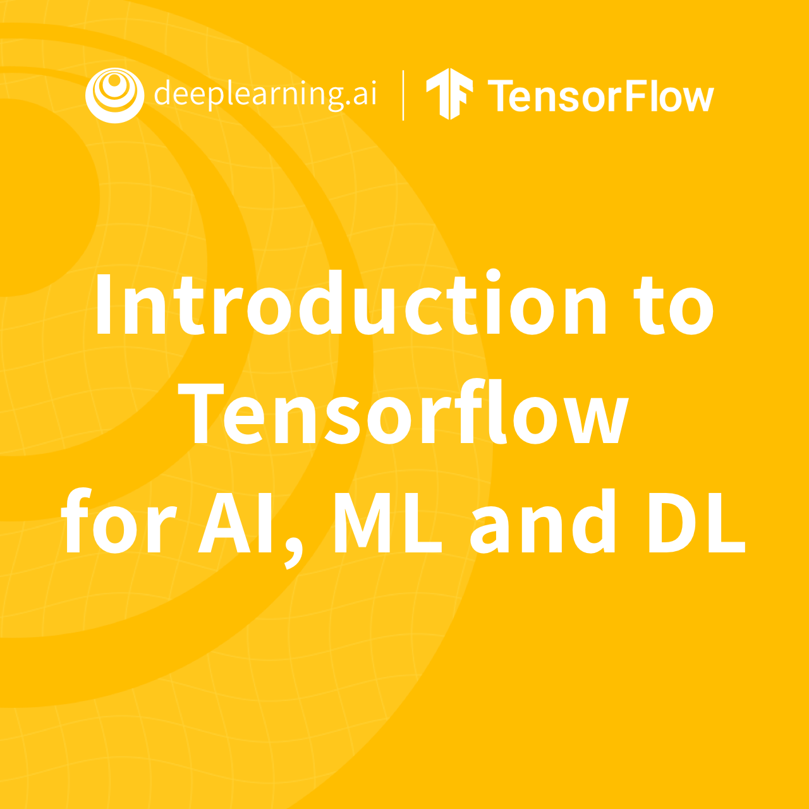
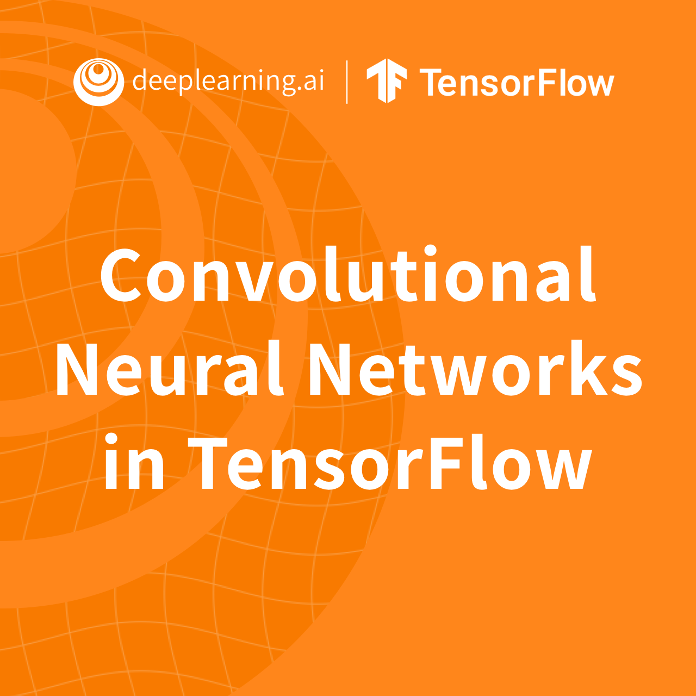
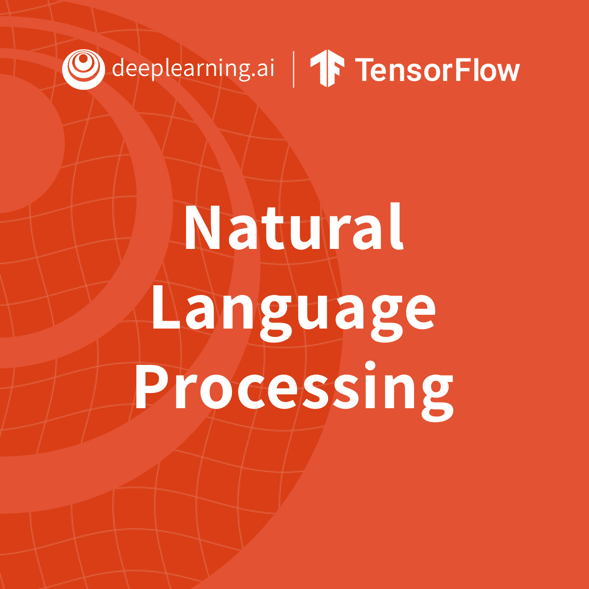
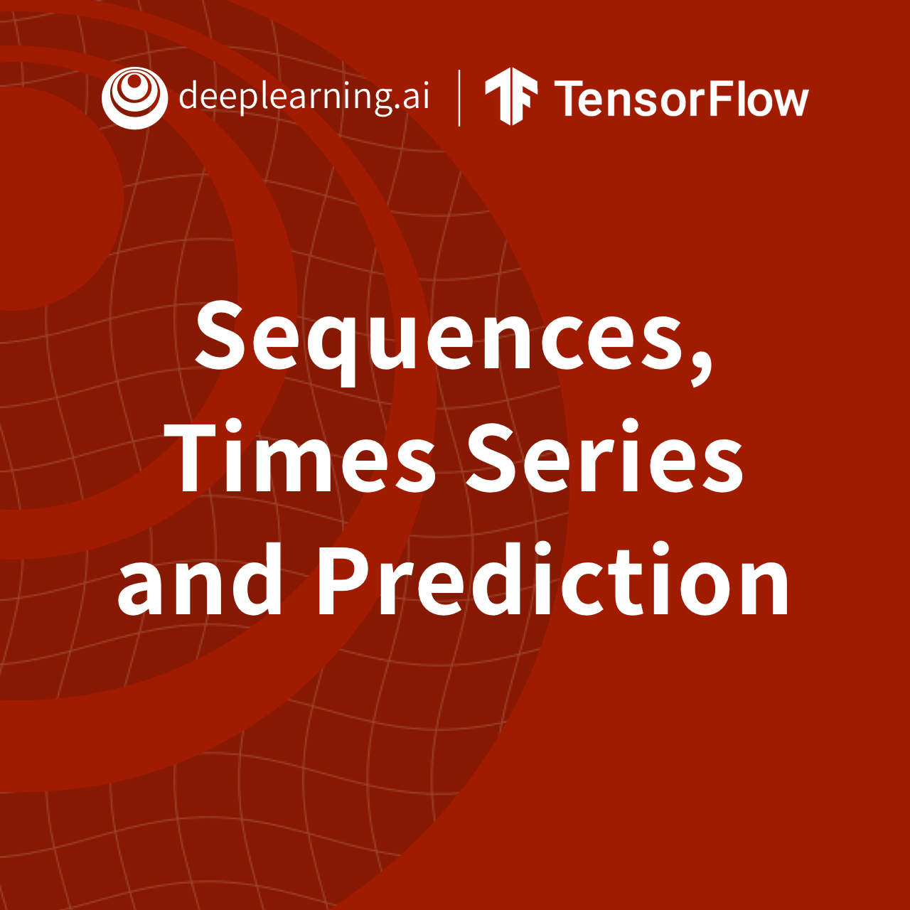

# DeepLearning.AI TensorFlow Developer 



**Course supported by：**[deeplearning.ai](https://www.deeplearning.ai/)

**Course address：**[coursera.org](https://www.coursera.org/professional-certificates/tensorflow-in-practice?)

**Lecturer：**[Laurence Moroney](https://www.coursera.org/instructor/lmoroney)


## 食用方法：

- 本课程以 **Tensorflow2** 为核心，基于 **keras** 实践 **Tensorflow**

- 本门课程注重编程实践，尽量按照课程流程将代码敲一遍

- 目录结构：

  ```
  ├─TensorFlow in Practice
  	├─Course 1 - TensorFlow for AI, ML and DL 																			
  																							├─Labs		 # 实验编程代码
  	├─Course 2 - Convolutional Neural Networks
  	└─Course 3 - Natural Language Processing
  	└─Course 4 - Sequences, Time Series, and Prediction
  	└─Image
  ```

- 目录符号含义：
  - C：Course，代表第几门课
  - W：Week，代表第几周
  - L：Lecture，代表第几门教学代码
  - Assignment：代表课后习题代码

- 课程大纲：
  - [Introduction to TensorFlow for Artificial Intelligence, Machine Learning, and Deep Learning](https://www.coursera.org/learn/introduction-tensorflow)
  - [Convolutional Neural Networks in TensorFlow](https://www.coursera.org/learn/convolutional-neural-networks-tensorflow)
  - [Natural Language Processing in TensorFlow](https://www.coursera.org/learn/natural-language-processing-tensorflow)
  - [Sequences, Time Series and Prediction](https://www.coursera.org/learn/tensorflow-sequences-time-series-and-prediction)


# 联系方式

- 邮箱：tsuiraku@126.com