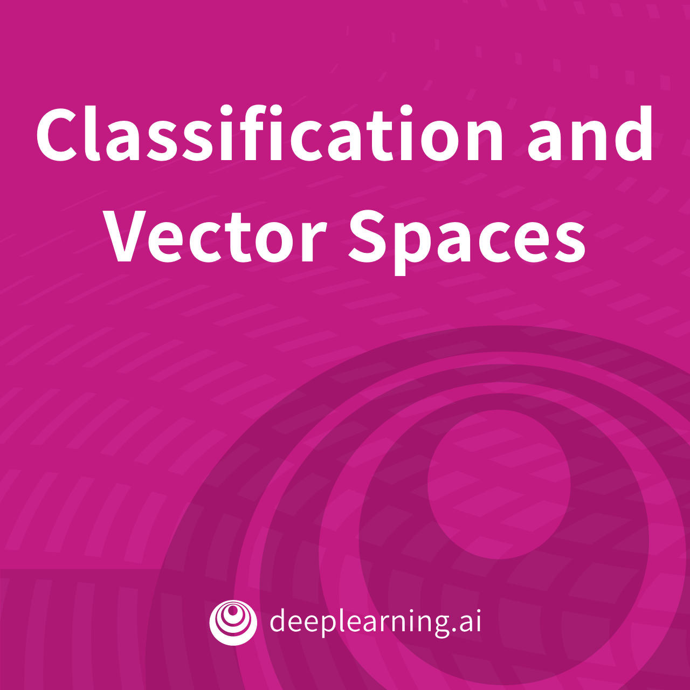
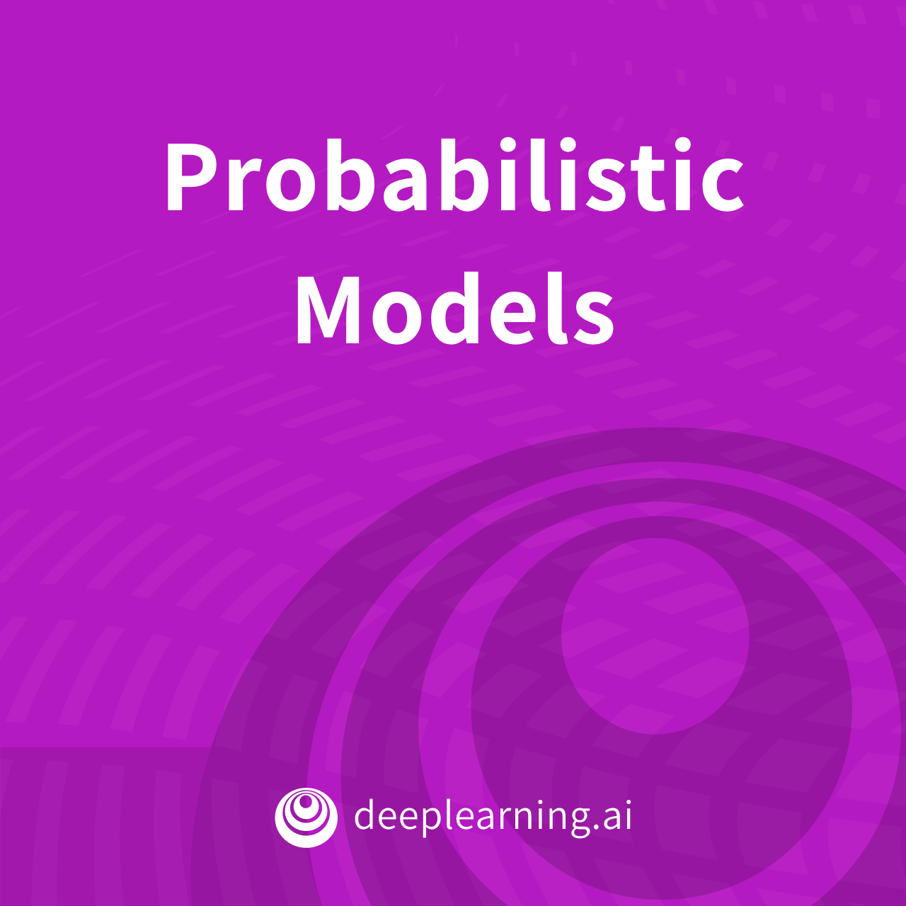
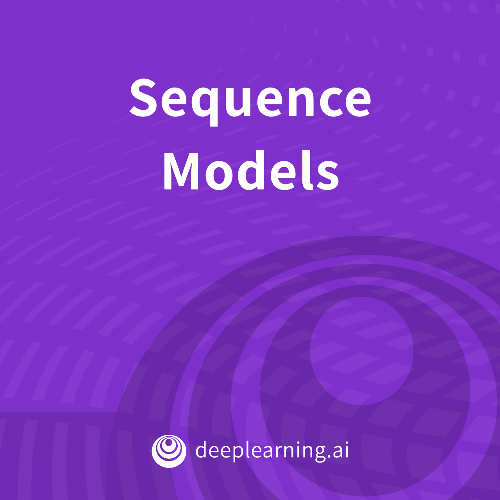
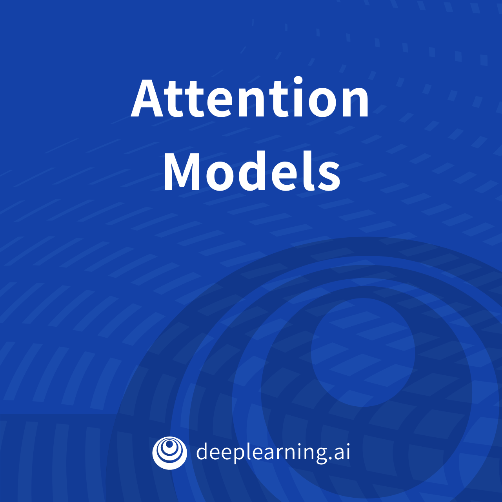

# Natural Language Processing Specialization


**Course supported by：**[deeplearning.ai](https://www.deeplearning.ai/natural-language-processing-specialization/)

**Course address：**[coursera.org](https://www.coursera.org/specializations/natural-language-processing)

**Lecturer：**[Younes Bensouda Mourri](https://www.coursera.org/instructor/ymourri) , [Łukasz Kaiser](https://www.coursera.org/instructor/lukaszkaiser) , [Eddy Shyu](https://www.coursera.org/instructor/eddy-shyu)


# 食用方法：

- 课程笔记由个人汉化，建议下载本地使用 [typora](https://www.baidu.com/link?url=ILb8r6q9x4RAT-_l6vqrxcy3OHlwejVSb1lsWEeaNyy&wd=&eqid=a970cbc60008bcb8000000065f8112f0) 打开文件，参考[原英文笔记](https://github.com/ijelliti/Deeplearning.ai-Natural-Language-Processing-Specialization)

- 本课程选择 **trax** 作为深度学习的框架，也可以选择 **pytorch** 和 **tensorflow**  等深度学习框架进行学习

- 目录文件结构：

```
├─Natutal Language Processing
	├─Course 1 - Classification and Vector Spaces 																																											    ├─Images   # 图片
																							├─Labs		 # 实验编程代码(含答案)
																							├─Lectures # PDF课件
																							├─Original # 实验编程源码
	├─Course 2 - Probabilistic Models
	└─Course 3 - Sequence Models
	└─Course 4 - Attention Models 
	└─Image
```

- 目录符号含义：
  - C：Course，代表第几门课
  - W：Week，代表第几周
  - L：Lecture，代表第几门教学代码
  - Assignment：代表课后习题代码
  
- 课程大纲：

  - [Natural Language Processing with Classification and Vector Spaces](https://www.coursera.org/learn/classification-vector-spaces-in-nlp)

  - [Natural Language Processing with Probabilistic Models](https://www.coursera.org/learn/probabilistic-models-in-nlp)

  - [Natural Language Processing with Sequence Models](https://www.coursera.org/learn/sequence-models-in-nlp)

     

  - [Natural Language Processing with Attention Models](https://www.coursera.org/learn/attention-models-in-nlp)

# 问题


## Mac os 上 pip install trax==1.3.1 出现安装出错问题

```
#include <SDL.h>
             ^~~~~~~
    1 error generated.
    ---
    For help with compilation see:
        https://www.pygame.org/wiki/MacCompile
    To contribute to pygame development see:
        https://www.pygame.org/contribute.html
    ---
    error: command 'gcc' failed with exit status 1
```

### 解决方法：

1.终端运行以下命令

```
brew install sdl sdl_image sdl_mixer sdl_ttf portmidi

pip install pygame
```


## nltk.download('punkt') 无法下载的情况

```
[nltk_data] Error loading punkt: <urlopen error [SSL:
[nltk_data]     CERTIFICATE_VERIFY_FAILED] certificate verify failed:
[nltk_data]     unable to get local issuer certificate (_ssl.c:1076)>
```

### 解决方法：

1.添加如下代码

```python
import nltk
import re
import ssl

try:
    _create_unverified_https_context = ssl._create_unverified_context
except AttributeError:
    pass
else:
    ssl._create_default_https_context = _create_unverified_https_context

nltk.download('punkt')
```


# 联系方式

- 邮箱：tsuiraku@126.com